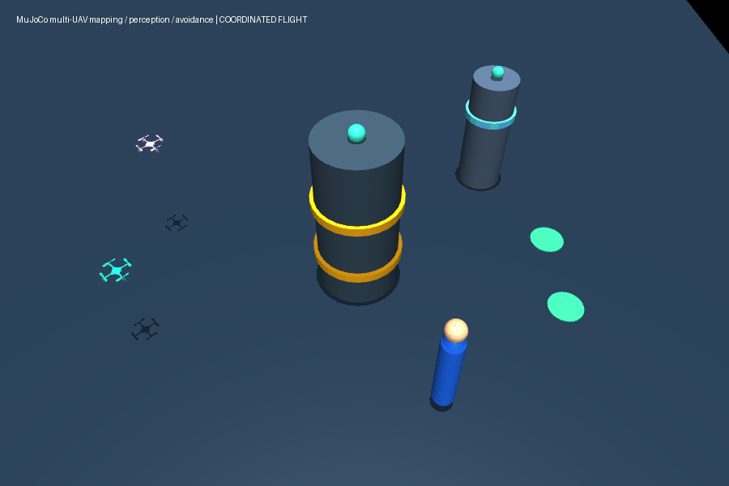

# 多无人机自主建图、识别、避障与协同系统

一个面向 PX4 + ROS 2 的可扩展项目骨架。仓库内置纯 Python 多机仿真，因此不需要飞控、Docker 或 GPU 也能验证核心闭环；适配层为 PX4、YOLO、KISS-ICP/VINS-Fusion、Fast-Planner、EGO-Planner-v2 与 Zenoh 留出明确接口。

## MuJoCo 三维演示



该动画由 MuJoCo 实际渲染：两架不同高度的四旋翼绕开红色建筑，识别并预测蓝色动态行人，并保持机间间距。执行 `python tools/render_mujoco_demo.py` 可重新生成。

## 已可运行的闭环

```text
动态世界 → 语义感知 → 局部占据地图 → 任务分配 → 预测避碰 → 安全速度指令
                   ↑                                  ↓
               多机地图/目标状态 ← Zenoh / ROS 2 DDS ←──┘
```

- 两架无人机执行不同目标的覆盖任务；
- 红色固定障碍与蓝色动态障碍进入各机的局部观测；
- 每架机维护并合并二维占据栅格；
- 贪心任务分配、动态障碍预测和机间最小间距约束；
- 每一步输出可审计的感知、建图、协同和安全状态。

浏览器可视化：直接双击 `visualization.html`，或在 PowerShell 中执行 `Start-Process .\visualization.html`。

三维可视化：执行 `Start-Process .\visualization_3d.html`，可查看飞行高度、立体障碍、无人机姿态与平滑避障过程。

## 快速开始

```powershell
python -m venv .venv
.\.venv\Scripts\python.exe -m pip install -r requirements.txt
.\.venv\Scripts\python.exe tools\run_demo.py --steps 240
.\.venv\Scripts\python.exe -m unittest discover -s tests -v
```

运行后会生成 `artifacts/mission_summary.json`。成功条件为全部任务完成、无障碍/机间碰撞、至少一次动态障碍预测介入。

## 真机/高保真接入顺序

1. 使用 `external.repos` 在 Ubuntu 22.04 / ROS 2 Humble 工作区拉取上游项目。
2. 先启用 PX4 SITL 与 `aerial-autonomy-stack` 多机仿真；每台机使用独立命名空间 `/uav_1`、`/uav_2`。
3. `Px4Adapter` 接收 PX4 local odometry，并发送 Offboard 速度或轨迹点。
4. `PerceptionAdapter` 将 YOLO 目标和 KISS-ICP/VINS-Fusion 位姿写入 `SemanticObservation`。
5. 将 `OccupancyMap` 接到 Fast-Planner，替换本仓库的轻量局部规划器。
6. 将 `PeerState`/轨迹广播接到 EGO-Planner-v2，并用 Zenoh 进行跨机 ROS 2 主题桥接。

## 上游项目

- [aerial-autonomy-stack](https://github.com/JacopoPan/aerial-autonomy-stack)：PX4/ArduPilot、多机 ROS 2 仿真、YOLO、LiDAR odometry、Zenoh。
- [Fast-Planner](https://github.com/HKUST-Aerial-Robotics/Fast-Planner)：局部建图、探索和四旋翼轨迹规划。
- [EGO-Planner-v2](https://github.com/ZJU-FAST-Lab/EGO-Planner-v2)：多机轨迹协调与机间避碰。
- [MRS UAV System](https://github.com/ctu-mrs/mrs_uav_system)：多旋翼控制、估计和实验验证平台。

这些项目保留各自许可证；本仓库不复制其源码。
